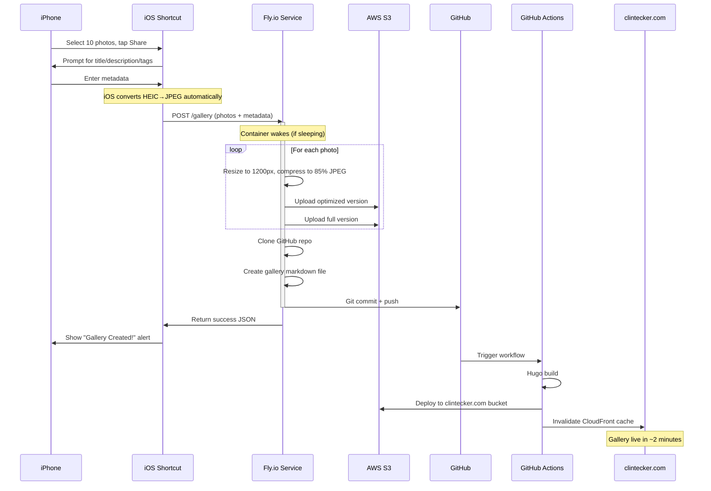

# Gallery Service

Mobile-first gallery creation service for clintecker.com.

## What it does

1. Receives photos from iOS Share Sheet
2. Optimizes images (resize, compress)
3. Uploads to S3 (`i.clintecker.com/galleries/`)
4. Creates gallery markdown file
5. Commits to GitHub
6. Triggers site deployment

## Architecture



## Data Flow

```mermaid
graph LR
    A[iPhone Photos] -->|Share Sheet| B[iOS Shortcut]
    B -->|HEIC→JPEG| C[HTTP POST]
    C -->|500MB max| D[Fly.io Container]

    D -->|Process| E[Pillow]
    E -->|Optimize| F[1200px JPEG 85%]

    F -->|Upload| G[S3: i.clintecker.com]
    G -->|galleries/2025/jan/slug/| H[Optimized + Full]

    D -->|Git Operations| I[Clone Repo]
    I -->|Create| J[content/galleries/YYYY-MM-DD-slug.md]
    J -->|Commit & Push| K[GitHub]

    K -->|Webhook| L[GitHub Actions]
    L -->|Hugo Build| M[public/]
    M -->|Deploy| N[S3: clintecker.com]
    N -->|Invalidate| O[CloudFront]

    O -->|Live| P[https://clintecker.com/galleries/slug/]
```



## Limits & Performance

### Photo Limits
- **Maximum photos per gallery:** 50
- **Maximum total upload size:** 50MB
- **Maximum processing time:** 2 minutes

### Pre-Processing (iOS Shortcut)
**The shortcut resizes images on your iPhone BEFORE upload:**
- **Input:** 12MP HEIC (8-12MB each)
- **Shortcut resizes:** 1200px width
- **Shortcut converts:** HEIC → JPEG @ 85% quality
- **Output:** ~300KB per photo

**Why pre-process?**
- 40x smaller uploads (12MB → 300KB)
- Much faster (30 sec vs 3 min)
- More photos allowed (50 vs 20)
- Works on slower connections

### Performance with Pre-Processing
| Photos | Upload Size | Processing Time | Status |
|--------|-------------|-----------------|---------|
| 1-10   | 3-5MB       | 10-20s         | ✅ Very Fast |
| 11-20  | 6-10MB      | 20-40s         | ✅ Fast |
| 21-30  | 9-15MB      | 40-60s         | ✅ Good |
| 31-40  | 12-20MB     | 60-80s         | ✅ OK |
| 41-50  | 15-25MB     | 80-120s        | ✅ Max |
| 51+    | 25MB+       | N/A            | ❌ Rejected |

### Memory & CPU
- **Container RAM:** 512MB (sufficient for pre-resized)
- **CPU:** 1 shared vCPU
- **Typical memory usage:** 150-250MB
- **Peak memory:** 350MB (50 photos)

### Why 50 photo limit?
1. **Reasonable gallery size** - 50 photos is a large gallery
2. **GitHub commit size** - Keep commits reasonable
3. **User experience** - 2 minute wait is acceptable

**Solution for larger batches:** Create multiple galleries (e.g., "LV FW25 Part 1", "LV FW25 Part 2")

## Setup

### 1. Install Fly.io CLI

```bash
brew install flyctl
flyctl auth login
```

### 2. Create Fly.io app

```bash
cd gallery-service
flyctl apps create clintecker-gallery
```

### 3. Set secrets

```bash
# AWS credentials (same as GitHub Actions)
flyctl secrets set AWS_ACCESS_KEY_ID="your-key-id"
flyctl secrets set AWS_SECRET_ACCESS_KEY="your-secret-key"

# GitHub Personal Access Token (needs repo write permissions)
flyctl secrets set GITHUB_TOKEN="your-github-token"
```

### 4. Deploy

```bash
flyctl deploy
```

### 5. Get the app URL

```bash
flyctl info
# Note the hostname, e.g., clintecker-gallery.fly.dev
```

## iOS Shortcut Setup

1. Open Shortcuts app on iPhone
2. Create new Shortcut
3. Name it "Create Gallery"
4. Add these actions:

```
1. Get File (from Shortcut Input) - Type: Images
2. Ask for Input - Prompt: "Gallery Title" - Default: ""
3. Ask for Input - Prompt: "Description (optional)" - Default: ""
4. Ask for Input - Prompt: "Tags (comma-separated, optional)" - Default: ""
5. Get Contents of URL
   - URL: https://clintecker-gallery.fly.dev/gallery
   - Method: POST
   - Request Body: Form
   - Form fields:
     * title = Provided Input (from step 2)
     * description = Provided Input (from step 3)
     * tags = Provided Input (from step 4)
     * photos = Get File (from step 1)
6. Show Alert
   - Title: "Gallery Created!"
   - Message: Get Variable (Contents of URL)
```

7. In Shortcut settings:
   - Enable "Show in Share Sheet"
   - Accept Types: Images

## Testing locally

```bash
# Set environment variables
export AWS_ACCESS_KEY_ID="your-key"
export AWS_SECRET_ACCESS_KEY="your-secret"
export GITHUB_TOKEN="your-token"

# Run the app
python app.py

# Test with curl
curl -X POST http://localhost:8080/gallery \
  -F "title=Test Gallery" \
  -F "description=Testing" \
  -F "tags=test,demo" \
  -F "photos=@photo1.jpg" \
  -F "photos=@photo2.jpg"
```

## How it works

**Flow:**
1. iOS Share Sheet → Shortcut
2. Shortcut → POST /gallery with photos + metadata
3. Service optimizes images (1200px wide, JPEG, 85% quality)
4. Uploads to `s3://i.clintecker.com/galleries/YYYY/mmm/slug/`
5. Creates `content/galleries/YYYY-MM-DD-slug.md`
6. Commits and pushes to GitHub
7. GitHub Actions builds and deploys site
8. Gallery appears at `https://clintecker.com/galleries/slug/`

**Cost:** ~$8/month on Fly.io (1GB RAM) - scales to $0 when idle for extended periods

## FAQ

### What format are iOS photos?
- **iOS default:** HEIC (High Efficiency Image Container)
- **Shortcut pre-processes:** Resizes to 1200px, converts HEIC → JPEG @ 85%
- **What service receives:** Pre-resized JPEGs (~300KB each)
- **What server does:** Light compression check, upload to S3
- **What gets uploaded to S3:** ~300KB optimized + original resized version

### What if I select 60 photos?
**Service will reject with error:** `"Too many photos. Maximum 50, got 60"`

**Workaround:** Create two galleries:
1. Select 30 photos → "LV FW25 Part 1"
2. Select 30 photos → "LV FW25 Part 2"

### What if upload fails mid-way?
**Photos already uploaded to S3 remain there** (no rollback)

**No gallery created:** If git push fails, photos are in S3 but no gallery markdown exists

**Solution:** Retry the upload, or manually create the gallery markdown file

### Can I add more photos to an existing gallery later?
**Not through the service** (it creates new galleries only)

**Manual method:**
1. Upload photos to S3: `s3://i.clintecker.com/galleries/YYYY/mmm/slug/`
2. Edit `content/galleries/YYYY-MM-DD-slug.md`
3. Add new photo entries to `photos:` array
4. Commit and push

### Why does it take 30-120 seconds?
**Time breakdown for 30-photo gallery:**
- iOS pre-processing: 5-10 sec (resize, convert on device)
- iOS upload: 15-30 sec (9MB vs 360MB)
- Server: Light compression check: 5-10 sec
- S3 uploads: 15-25 sec (60 files: optimized + full)
- Git operations: 10-20 sec (clone, commit, push)
- GitHub Actions: Not counted (happens async, ~2 min)

**Total:** 30-120 seconds from tap to "Gallery Created!" alert (depending on photo count)

### How much does this cost?
**Fly.io:** ~$5/month (512MB RAM, 1 CPU, scales to zero)
- First 3GB RAM-hours free per month
- After that: ~$0.0000011/sec when running
- Idle = $0
- If used daily for galleries: ~$5/month

**AWS S3/CloudFront:** Already paying for these

**GitHub Actions:** Free tier sufficient

**Total new cost:** ~$5/month

### Pre-processing saves money!
By resizing on-device:
- Smaller server needed (512MB vs 1GB)
- Less CPU time (seconds vs minutes)
- Less bandwidth
- **Result:** ~$3/month savings
